This is my coursework. Our group is wondering the crime in Boston area.
We use the dataset from Kaggle, [Crime in
Boston](https://www.kaggle.com/AnalyzeBoston/crimes-in-boston)

-   What’s the dataset about?

This is a dataset containing records from the new crime incident report
system in Boston area, which includes a reduced set of fields focused on
capturing the type of incident as well as when and where it occurred.

-   Which party collected the dataset?

Crime incident reports are provided by Boston Police Department (BPD) to
document the initial details surrounding an incident to which BPD
officers respond.

-   Which period of time is covered?

June 14, 2015 to September 3, 2018

Load Library
============

``` r
library(tidyverse)
library(DataExplorer)
library(lubridate)
```


Load Data
=========

``` r
Boston_Crime <- read.table("Boston_Crime.csv", header = TRUE, sep=",")
```

Inspecting data frames
======================

Use head() function to view the first few rows.

``` r
head(Boston_Crime,5)
```

    ##   INCIDENT_NUMBER OFFENSE_CODE OFFENSE_CODE_GROUP
    ## 1      I182080058         2403 Disorderly Conduct
    ## 2      I182080053         3201      Property Lost
    ## 3      I182080052         2647              Other
    ## 4      I182080051          413 Aggravated Assault
    ## 5      I182080050         3122           Aircraft
    ##              OFFENSE_DESCRIPTION DISTRICT REPORTING_AREA SHOOTING
    ## 1           DISTURBING THE PEACE      E18            495         
    ## 2                PROPERTY - LOST      D14            795         
    ## 3      THREATS TO DO BODILY HARM       B2            329         
    ## 4 ASSAULT - AGGRAVATED - BATTERY       A1             92         
    ## 5             AIRCRAFT INCIDENTS       A7             36         
    ##   OCCURRED_ON_DATE YEAR MONTH DAY_OF_WEEK HOUR   UCR_PART       STREET
    ## 1 2018-10-03 20:13 2018    10   Wednesday   20   Part Two ARLINGTON ST
    ## 2 2018-08-30 20:00 2018     8    Thursday   20 Part Three   ALLSTON ST
    ## 3 2018-10-03 19:20 2018    10   Wednesday   19   Part Two     DEVON ST
    ## 4 2018-10-03 20:00 2018    10   Wednesday   20   Part One CAMBRIDGE ST
    ## 5 2018-10-03 20:49 2018    10   Wednesday   20 Part Three  PRESCOTT ST
    ##        Lat      Long                    Location
    ## 1 42.26261 -71.12119 (42.26260773, -71.12118637)
    ## 2 42.35211 -71.13531 (42.35211146, -71.13531147)
    ## 3 42.30813 -71.07693 (42.30812619, -71.07692974)
    ## 4 42.35945 -71.05965 (42.35945371, -71.05964817)
    ## 5 42.37526 -71.02466 (42.37525782, -71.02466343)

Use str() function to check the structure of the data

``` r
str(Boston_Crime)
```

    ## 'data.frame':    151764 obs. of  17 variables:
    ##  $ INCIDENT_NUMBER    : Factor w/ 134389 levels "142052550","I010370257-00",..: 134389 134388 134387 134386 134385 134384 134383 134382 134381 134380 ...
    ##  $ OFFENSE_CODE       : int  2403 3201 2647 413 3122 1402 3803 3301 802 3410 ...
    ##  $ OFFENSE_CODE_GROUP : Factor w/ 66 levels "Aggravated Assault",..: 14 52 46 1 2 63 43 64 61 62 ...
    ##  $ OFFENSE_DESCRIPTION: Factor w/ 242 levels "A&B HANDS, FEET, ETC.  - MED. ATTENTION REQ.",..: 62 185 220 13 5 229 160 230 21 221 ...
    ##  $ DISTRICT           : Factor w/ 13 levels "","A1","A15",..: 12 9 5 2 4 7 1 5 12 10 ...
    ##  $ REPORTING_AREA     : int  495 795 329 92 36 351 NA 603 543 621 ...
    ##  $ SHOOTING           : Factor w/ 2 levels "","Y": 1 1 1 1 1 1 1 1 1 1 ...
    ##  $ OCCURRED_ON_DATE   : Factor w/ 114576 levels "2015-06-15 0:00",..: 114572 112099 114564 114571 114574 114524 114573 114567 114565 114571 ...
    ##  $ YEAR               : int  2018 2018 2018 2018 2018 2018 2018 2018 2018 2018 ...
    ##  $ MONTH              : int  10 8 10 10 10 10 10 10 10 10 ...
    ##  $ DAY_OF_WEEK        : Factor w/ 7 levels "Friday","Monday",..: 7 5 7 7 7 6 7 7 7 7 ...
    ##  $ HOUR               : int  20 20 19 20 20 20 20 19 19 20 ...
    ##  $ UCR_PART           : Factor w/ 5 levels "","Other","Part One",..: 5 4 5 3 4 5 4 4 5 4 ...
    ##  $ STREET             : Factor w/ 4241 levels ""," ALBANY ST ",..: 180 100 1059 615 3129 1093 1 3834 241 856 ...
    ##  $ Lat                : num  42.3 42.4 42.3 42.4 42.4 ...
    ##  $ Long               : num  -71.1 -71.1 -71.1 -71.1 -71 ...
    ##  $ Location           : Factor w/ 15433 levels "(-1.00000000, -1.00000000)",..: 729 12456 5788 13499 14566 4885 7672 9497 477 11790 ...

``` r
summary(Boston_Crime)
```

    ##       INCIDENT_NUMBER    OFFENSE_CODE 
    ##  I152080623   :    11   Min.   : 111  
    ##  I172096394   :    10   1st Qu.:1001  
    ##  I182065208   :    10   Median :2914  
    ##  I162071327   :     9   Mean   :2318  
    ##  I172056883   :     9   3rd Qu.:3201  
    ##  I130041200-00:     8   Max.   :3831  
    ##  (Other)      :151707                 
    ##                        OFFENSE_CODE_GROUP
    ##  Motor Vehicle Accident Response:17733   
    ##  Larceny                        :12268   
    ##  Medical Assistance             :11193   
    ##  Investigate Person             : 8883   
    ##  Other                          : 8502   
    ##  Drug Violation                 : 7702   
    ##  (Other)                        :85483   
    ##                             OFFENSE_DESCRIPTION    DISTRICT    
    ##  SICK/INJURED/MEDICAL - PERSON        :  8908   B2     :23667  
    ##  INVESTIGATE PERSON                   :  8887   C11    :20340  
    ##  M/V - LEAVING SCENE - PROPERTY DAMAGE:  7790   D4     :19929  
    ##  VANDALISM                            :  7351   A1     :17074  
    ##  ASSAULT SIMPLE - BATTERY             :  7076   B3     :16875  
    ##  VERBAL DISPUTE                       :  6190   C6     :11204  
    ##  (Other)                              :105562   (Other):42675  
    ##  REPORTING_AREA  SHOOTING           OCCURRED_ON_DATE       YEAR     
    ##  Min.   :  0.0    :151229   2015-06-18 5:00 :    22   Min.   :2015  
    ##  1st Qu.:177.0   Y:   535   2015-07-01 0:00 :    16   1st Qu.:2016  
    ##  Median :344.0              2017-06-01 0:00 :    16   Median :2016  
    ##  Mean   :383.7              2015-12-07 11:38:    14   Mean   :2017  
    ##  3rd Qu.:546.0              2015-10-02 21:00:    13   3rd Qu.:2017  
    ##  Max.   :962.0              2016-04-01 0:00 :    13   Max.   :2018  
    ##  NA's   :9664               (Other)         :151670                 
    ##      MONTH           DAY_OF_WEEK         HOUR             UCR_PART    
    ##  Min.   : 1.000   Friday   :23242   Min.   : 0.00             :   42  
    ##  1st Qu.: 4.000   Monday   :21896   1st Qu.: 9.00   Other     :  578  
    ##  Median : 7.000   Saturday :22236   Median :14.00   Part One  :29375  
    ##  Mean   : 6.733   Sunday   :19905   Mean   :13.08   Part Three:75654  
    ##  3rd Qu.: 9.000   Thursday :21212   3rd Qu.:18.00   Part Two  :46115  
    ##  Max.   :12.000   Tuesday  :22050   Max.   :23.00                     
    ##                   Wednesday:21223                                     
    ##             STREET            Lat             Long       
    ##  WASHINGTON ST :  6596   Min.   :-1.00   Min.   :-71.18  
    ##                :  5303   1st Qu.:42.30   1st Qu.:-71.10  
    ##  BLUE HILL AVE :  3703   Median :42.33   Median :-71.08  
    ##  BOYLSTON ST   :  3472   Mean   :42.21   Mean   :-70.89  
    ##  DORCHESTER AVE:  2457   3rd Qu.:42.35   3rd Qu.:-71.06  
    ##  TREMONT ST    :  2288   Max.   :42.40   Max.   : -1.00  
    ##  (Other)       :127945   NA's   :9460    NA's   :9460    
    ##                         Location     
    ##  (0.00000000, 0.00000000)   :  9460  
    ##  (42.34862382, -71.08277637):   572  
    ##  (42.36183857, -71.05976489):   548  
    ##  (42.28482577, -71.09137369):   542  
    ##  (42.32866284, -71.08563401):   461  
    ##  (42.25621592, -71.12401947):   395  
    ##  (Other)                    :139786

Anthor way: to use glimpse() function to see every column in a data
frame

``` r
glimpse(Boston_Crime)
```

    ## Observations: 151,764
    ## Variables: 17
    ## $ INCIDENT_NUMBER     <fct> I182080058, I182080053, I182080052, I18208...
    ## $ OFFENSE_CODE        <int> 2403, 3201, 2647, 413, 3122, 1402, 3803, 3...
    ## $ OFFENSE_CODE_GROUP  <fct> Disorderly Conduct, Property Lost, Other, ...
    ## $ OFFENSE_DESCRIPTION <fct> "DISTURBING THE PEACE", "PROPERTY - LOST",...
    ## $ DISTRICT            <fct> E18, D14, B2, A1, A7, C11, , B2, E18, D4, ...
    ## $ REPORTING_AREA      <int> 495, 795, 329, 92, 36, 351, NA, 603, 543, ...
    ## $ SHOOTING            <fct> , , , , , , , , , , , , , , , , , , , , , ...
    ## $ OCCURRED_ON_DATE    <fct> 2018-10-03 20:13, 2018-08-30 20:00, 2018-1...
    ## $ YEAR                <int> 2018, 2018, 2018, 2018, 2018, 2018, 2018, ...
    ## $ MONTH               <int> 10, 8, 10, 10, 10, 10, 10, 10, 10, 10, 10,...
    ## $ DAY_OF_WEEK         <fct> Wednesday, Thursday, Wednesday, Wednesday,...
    ## $ HOUR                <int> 20, 20, 19, 20, 20, 20, 20, 19, 19, 20, 19...
    ## $ UCR_PART            <fct> Part Two, Part Three, Part Two, Part One, ...
    ## $ STREET              <fct> ARLINGTON ST, ALLSTON ST, DEVON ST, CAMBRI...
    ## $ Lat                 <dbl> 42.26261, 42.35211, 42.30813, 42.35945, 42...
    ## $ Long                <dbl> -71.12119, -71.13531, -71.07693, -71.05965...
    ## $ Location            <fct> "(42.26260773, -71.12118637)", "(42.352111...

``` r
plot_intro(Boston_Crime)
```

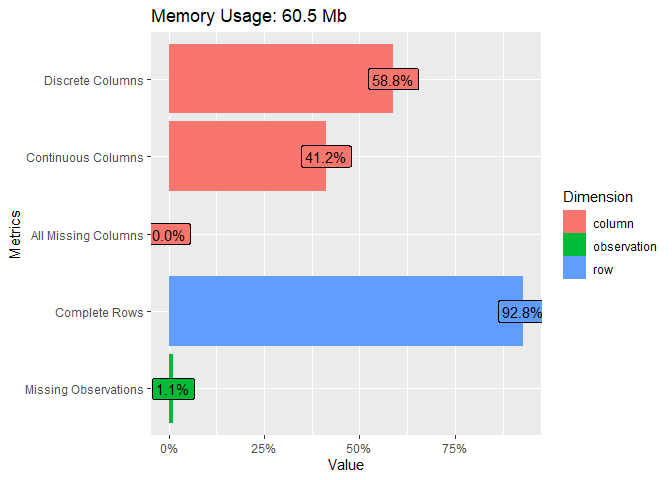

Let’s start the visualization and Exploratory Data Analysis (EDA)
=================================================================

``` r
plot_correlation(Boston_Crime)
```

    ## 6 features with more than 20 categories ignored!
    ## INCIDENT_NUMBER: 134389 categories
    ## OFFENSE_CODE_GROUP: 66 categories
    ## OFFENSE_DESCRIPTION: 242 categories
    ## OCCURRED_ON_DATE: 114576 categories
    ## STREET: 4241 categories
    ## Location: 15433 categories

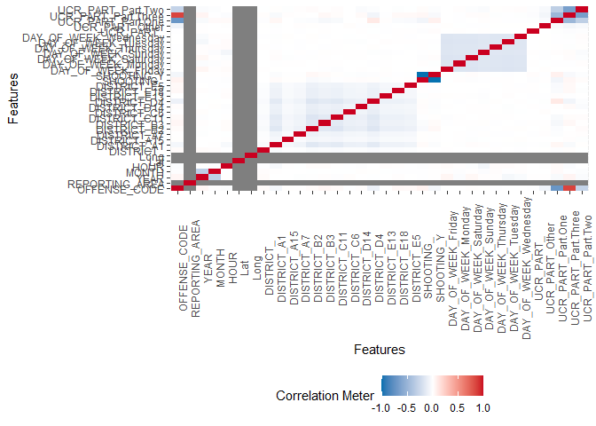

``` r
plot_histogram(Boston_Crime)
```

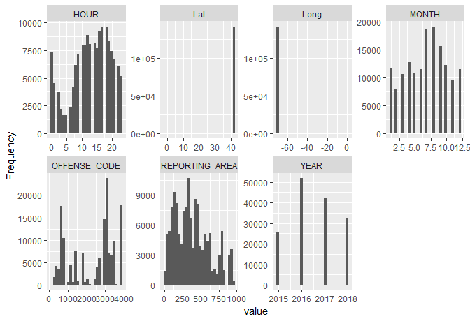

``` r
plot_bar(Boston_Crime)
```

    ## 6 columns ignored with more than 50 categories.
    ## INCIDENT_NUMBER: 134389 categories
    ## OFFENSE_CODE_GROUP: 66 categories
    ## OFFENSE_DESCRIPTION: 242 categories
    ## OCCURRED_ON_DATE: 114576 categories
    ## STREET: 4241 categories
    ## Location: 15433 categories

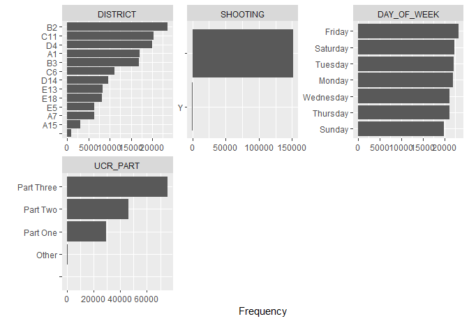

``` r
Boston_Crime  %>% separate(OCCURRED_ON_DATE, c("Date", "Time"), sep = " ") %>% mutate(Date = ymd(Date)) %>% 
    ggplot(aes(Date))+
    geom_freqpoly() +
    ylab("Number of Crimes")
```

    ## `stat_bin()` using `bins = 30`. Pick better value with `binwidth`.

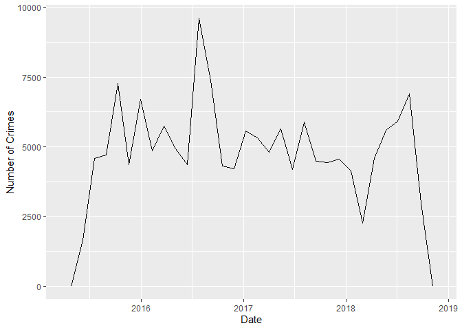

``` r
Boston_Crime  %>% count(OFFENSE_CODE_GROUP) %>% arrange(-n) %>% head(30) %>% 
  ggplot(aes(reorder(OFFENSE_CODE_GROUP,n), n))+
  geom_col()+
  coord_flip()+
  labs(x = NULL, y = 'Counts')
```

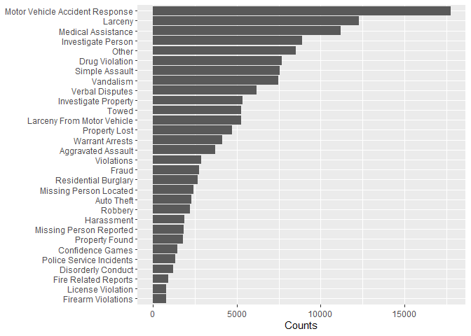

``` r
Boston_Crime %>% count(STREET) %>% arrange(-n) %>% head(15) %>% 
    ggplot(aes(reorder(STREET,n), n))+
    geom_col()+
    coord_flip()+
    labs(x = NULL, y = NULL)
```

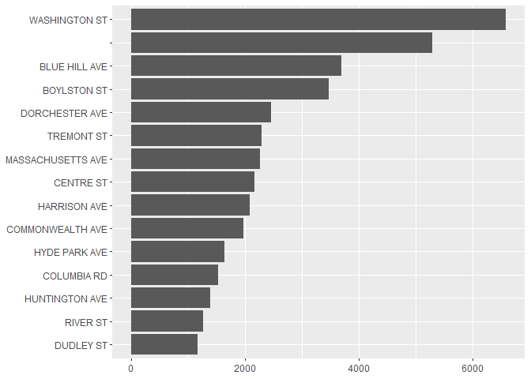

``` r
Boston_Crime %>% filter(DISTRICT %in% (Boston_Crime %>% count(DISTRICT) %>% arrange(-n) %>% pull(DISTRICT)),
                OFFENSE_CODE_GROUP %in% (Boston_Crime %>% count(OFFENSE_CODE_GROUP) %>% arrange(-n) %>% head(5) %>% pull(OFFENSE_CODE_GROUP))
                ) %>% 
    ggplot(aes(DISTRICT, fill = OFFENSE_CODE_GROUP))+
    geom_bar()+
    scale_fill_ordinal()+
    coord_flip()
```

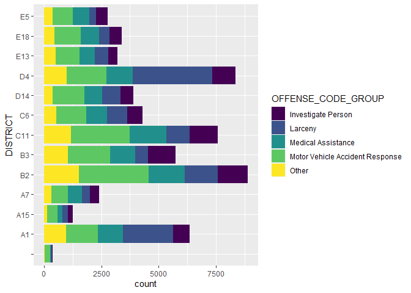

``` r
Boston_Crime %>% filter(STREET %in% (Boston_Crime %>% count(STREET) %>% arrange(-n) %>% head(5) %>% pull(STREET)),
                OFFENSE_CODE_GROUP %in% (Boston_Crime %>% count(OFFENSE_CODE_GROUP) %>% arrange(-n) %>% head(5) %>% pull(OFFENSE_CODE_GROUP))
                ) %>% 
    ggplot(aes(STREET, fill = OFFENSE_CODE_GROUP))+
    geom_bar(position = "fill")+
    scale_fill_ordinal()+
    coord_flip()
```

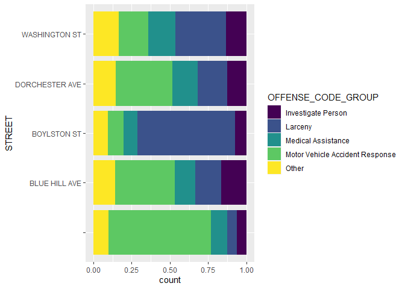

``` r
Boston_Crime %>% filter(STREET %in% (Boston_Crime %>% count(STREET) %>% arrange(-n) %>% head(5) %>% pull(STREET))) %>% 
    ggplot(aes(DISTRICT, fill = STREET))+
    geom_bar(position = "fill")+
    coord_flip()+
    scale_fill_ordinal()
```

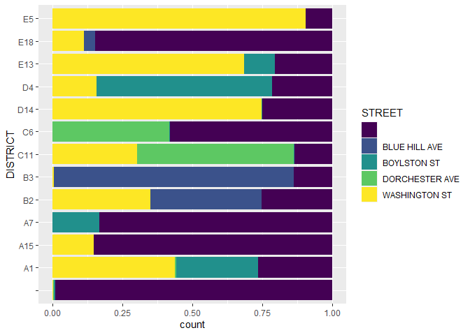

``` r
Boston_Crime %>% filter(STREET %in% (Boston_Crime %>% count(STREET) %>% arrange(-n) %>% head(5) %>% pull(STREET))) %>% 
    ggplot(aes(DAY_OF_WEEK, fill = STREET))+
    geom_bar()+
    coord_flip()+
    scale_fill_ordinal()
```

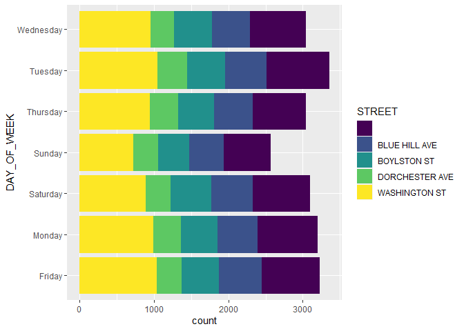

``` r
Boston_Crime %>% filter(OFFENSE_CODE_GROUP %in% (Boston_Crime %>% count(OFFENSE_CODE_GROUP) %>% arrange(-n) %>% head(5) %>% pull(OFFENSE_CODE_GROUP))) %>% 
    ggplot(aes(HOUR, fill = OFFENSE_CODE_GROUP))+
    geom_bar()+
    coord_flip()+
    scale_fill_ordinal()
```

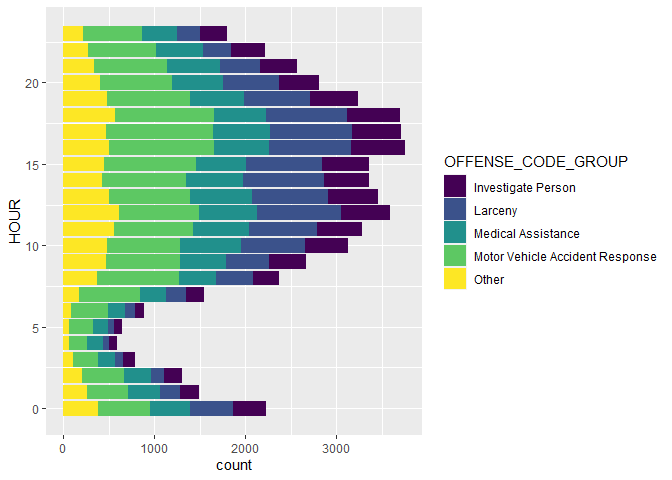

``` r
Boston_Crime %>% filter(OFFENSE_CODE_GROUP %in% (Boston_Crime %>% count(OFFENSE_CODE_GROUP) %>% arrange(-n) %>% head(5) %>% pull(OFFENSE_CODE_GROUP))) %>% 
  ggplot(aes(HOUR, fill = OFFENSE_CODE_GROUP))+
  geom_bar()+
  facet_wrap(~YEAR)+
  coord_flip()+
  scale_fill_ordinal()
```

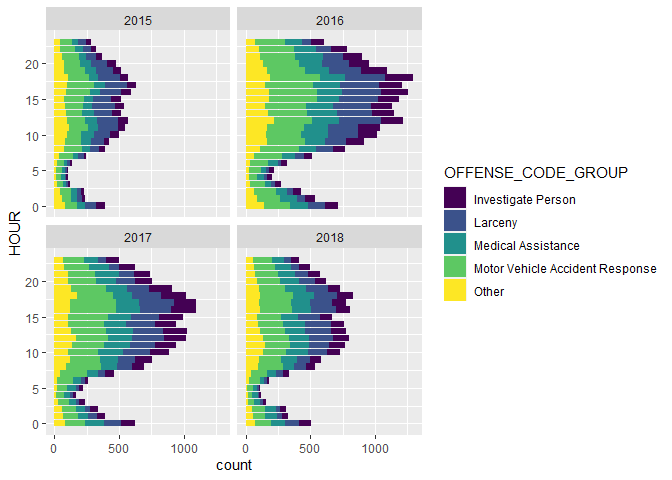

``` r
Boston_Crime %>% filter(OFFENSE_CODE_GROUP %in% (Boston_Crime %>% count(OFFENSE_CODE_GROUP) %>% arrange(-n) %>% head(5) %>% pull(OFFENSE_CODE_GROUP))) %>% 
  ggplot(aes(DISTRICT, fill = OFFENSE_CODE_GROUP))+
  geom_bar()+
  facet_wrap(~YEAR)+
  coord_flip()+
  scale_fill_ordinal()
```

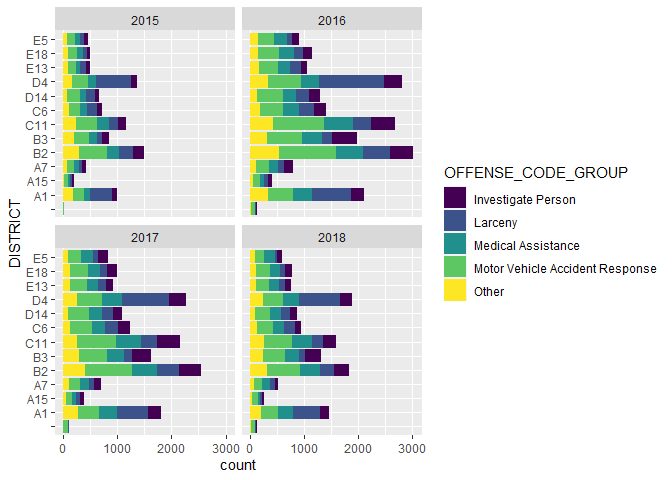

Resource
========

[ggplot
cheatsheet](https://rstudio.com/wp-content/uploads/2016/11/ggplot2-cheatsheet-2.1.pdf)

[Introduction to Data Exploration and Analysis with
R](https://bookdown.org/mikemahoney218/IDEAR/visualizing-your-data.html#diamonds)

[Kaggle Notebook - Crime in Boson EDA with
R](https://www.kaggle.com/ekrembayar/crimes-in-boston-eda-with-r)
